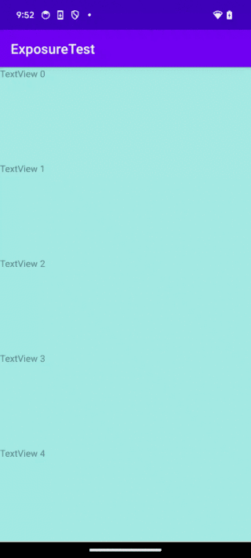

# Gaea 曝光检测

在 Android 上简单便捷的监听 View 的曝光比例变化，无论 View 是在 ViewPager、RecycleView 还是 ScrollView 里，甚至各种横向纵向的嵌套，在其曝光比例发生变化时均能高效且准确的检测到。



## 简单使用

假如有一个轮播图控件 carouselView,我们希望其可见面积小于 80%时停止滚动，使用 Gaea 曝光检测即可方便的实现这个功能:

```
carouselView.addGaeaExposureThresholdListener(0.8f) { visible->
    if(visible) {
        carouselView.resume() //可见性区域大于80%恢复滚动
    } else {
        carouselView.pause() //可见性区域小于80%时暂停滚动
    }
}
```

进阶使用可参考 app 模块内的示范代码

## 关于性能

本检测机制进行了多项优化，在快看漫画 app 首页上进行了长期试验，使用的测试手机为以 21 年低端机 oppo reno，在我们的埋点业务需求中，需要为各 tab 下几乎所有模块和内容做曝光检测以进行埋点，极端情况下涉及的 view(包括各层父 view)有上百个，每 100ms 进行一次检测，平均每次检测耗时 0.26ms。
